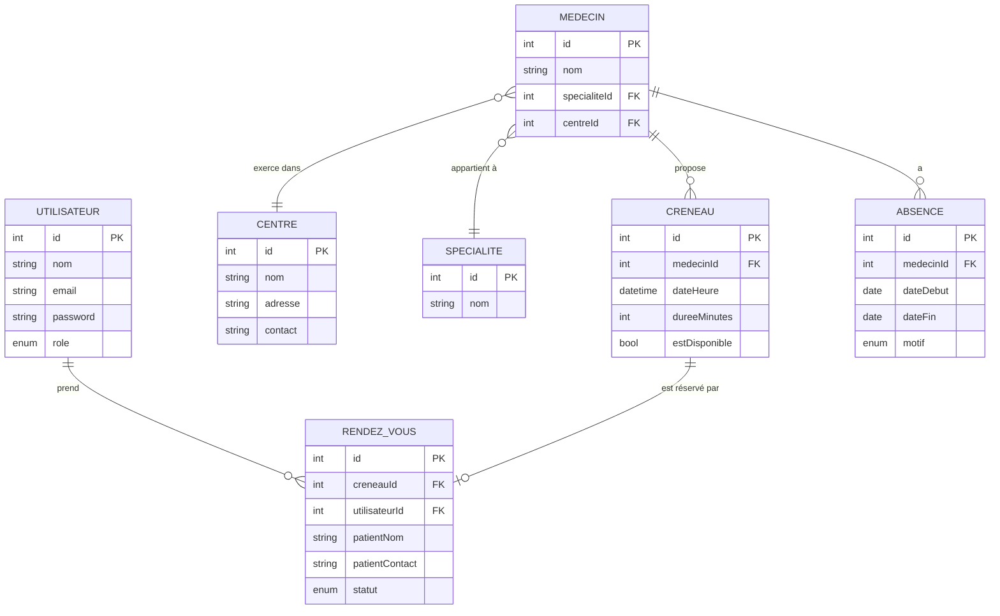

# Nesten — Plateforme de Prise de Rendez-vous Médicaux

> Application web full-stack permettant aux patients de consulter des créneaux disponibles et de réserver des rendez-vous médicaux, avec un espace d'administration complet pour la gestion des médecins, centres et plannings.

---

## Sommaire

- [Fonctionnalités](#fonctionnalités)
- [Stack technique](#stack-technique)
- [Architecture](#architecture)
- [Prérequis](#prérequis)
- [Installation](#installation)
- [Variables d'environnement](#variables-denvironnement)
- [Base de données](#base-de-données)
- [Lancer le projet](#lancer-le-projet)
- [Tests](#tests)
- [Structure du projet](#structure-du-projet)
- [API — Endpoints](#api--endpoints)
- [Modèle de données](#modèle-de-données)
- [Auteur](#auteur)

---

## Fonctionnalités

### Espace Patient
- Consultation des créneaux disponibles (par médecin, spécialité ou centre)
- Réservation d'un créneau
- Suivi de ses rendez-vous

### Espace Administrateur
- Tableau de bord centralisé
- Gestion des centres médicaux (CRUD)
- Gestion des spécialités médicales (CRUD)
- Gestion des médecins (CRUD)
- Gestion des absences médecins (congés, maladie, autre)
- Gestion des créneaux (création, activation / désactivation)
- Gestion des rendez-vous

### Sécurité
- Authentification par **JWT** (durée de vie : 7 jours)
- Hachage des mots de passe avec **bcryptjs**
- Contrôle d'accès par rôle : `ADMIN` / `PATIENT`
- Validation des données entrantes avec **Zod**
- Guards Angular : `authGuard`, `adminGuard`, `patientGuard`
- Intercepteur HTTP pour l'injection automatique du token

---

## Stack technique

| Couche | Technologie | Version |
|---|---|---|
| Frontend | Angular (standalone components) | 22.0.0 |
| Langage frontend | TypeScript | 6.0.2 |
| Backend | Node.js + Express | Express 5.2.1 |
| ORM | Prisma | 5.22.0 |
| Base de données | PostgreSQL | 14+ |
| Hébergement BDD | Neon (cloud serverless) | — |
| Authentification | JSON Web Token | 9.0.3 |
| Hachage mot de passe | bcryptjs | 3.0.3 |
| Validation | Zod | 4.4.3 |
| Tests backend | Jest | 30.4.2 |
| Tests frontend | Vitest | 4.0.8 |
| Qualité de code | SonarCloud + GitHub Actions | — |

---

## Architecture

Le projet suit une **architecture modulaire en couches** :

```
Client (Angular 22)
        │
        ▼  HTTP / REST (CORS)
API REST (Express 5)
        │
        ▼  Prisma ORM
PostgreSQL (Neon Cloud)
```

### Backend — organisation par modules

Chaque module suit le pattern **Controller → Service → Repository → Prisma** :

```
modules/
├── auth/          → inscription, connexion, profil
├── centres/       → CRUD centres médicaux
├── specialites/   → CRUD spécialités
├── medecins/      → CRUD médecins
├── absences/      → gestion des absences médecins
├── creneaux/      → gestion des créneaux
└── rendezvous/    → gestion des rendez-vous
```

### Frontend — architecture orientée features

```
features/
├── auth/          → connexion / inscription
├── admin/         → tableau de bord et gestion (accès ADMIN)
├── creneaux/      → consultation des créneaux (accès PATIENT)
└── rendezvous/    → suivi des rendez-vous (accès PATIENT)
```

---

## Prérequis

- **Node.js** ≥ 18
- **npm** ≥ 9
- **Angular CLI** ≥ 22 — `npm install -g @angular/cli`
- Un compte **[Neon](https://neon.tech)** ou une instance **PostgreSQL** locale
- **Git**

---

## Installation

### 1. Cloner le dépôt

```bash
git clone https://github.com/dabo224/Nesten-Project.git
cd Nesten-Project
```

### 2. Installer les dépendances

```bash
# Backend
cd backend && npm install

# Frontend
cd ../frontend && npm install
```

---

## Variables d'environnement

Créer un fichier `.env` dans le dossier `backend/` :

```env
DATABASE_URL="postgresql://<user>:<password>@<host>/<database>?sslmode=require"
PORT=3000
JWT_SECRET=votre_secret_jwt_tres_long_et_aleatoire
JWT_EXPIRES_IN=7d
FRONTEND_URL=http://localhost:4200
```

> **Neon** est utilisé comme hébergeur PostgreSQL cloud. Vous pouvez utiliser une instance locale en adaptant `DATABASE_URL` (retirez `?sslmode=require`).

---

## Base de données

### Appliquer les migrations Prisma

```bash
cd backend
npx prisma migrate deploy
```

### Alimenter la base de données

```bash
# Via Prisma seed
npx prisma db seed

# Ou via les scripts SQL
psql -U <user> -d <database> -f ../database/schema.sql
psql -U <user> -d <database> -f ../database/seed.sql
```

### Visualiser la base (interface graphique)

```bash
npx prisma studio
# Accessible sur http://localhost:5555
```

---

## Lancer le projet

### Backend

```bash
cd backend
npm run dev     # mode développement avec rechargement automatique (nodemon)
npm start       # mode production
```

### Frontend

```bash
cd frontend
ng serve
```

| Service | URL |
|---|---|
| Frontend | http://localhost:4200 |
| API REST | http://localhost:3000 |
| Health check | http://localhost:3000/api/health |
| Prisma Studio | http://localhost:5555 |

---

## Tests

### Backend (Jest)

```bash
cd backend
npm test                 # lancer tous les tests
npm run test:watch       # mode watch
npm run test:coverage    # avec rapport de couverture (lcov)
```

### Frontend (Vitest)

```bash
cd frontend
ng test
```

Les rapports de couverture sont transmis automatiquement à **SonarCloud** via le pipeline CI/CD GitHub Actions lors de chaque push sur `main` ou `develop`.

---

## Structure du projet

```
nesten/
├── backend/
│   ├── prisma/
│   │   ├── schema.prisma          # Schéma de la base de données
│   │   ├── seed.js                # Données initiales
│   │   └── migrations/            # Historique des migrations
│   └── src/
│       ├── app.js                 # Configuration Express (middlewares, routes)
│       ├── index.js               # Point d'entrée du serveur
│       ├── common/
│       │   ├── config/            # Connexion base de données
│       │   ├── middleware/        # Auth JWT, gestion erreurs, validation
│       │   └── utils/             # Utilitaires et classes d'erreur
│       └── modules/               # Modules métier (1 dossier = 1 ressource)
│           ├── auth/
│           ├── absences/
│           ├── centres/
│           ├── creneaux/
│           ├── medecins/
│           ├── rendezvous/
│           └── specialites/
│
├── frontend/
│   └── src/app/
│       ├── core/
│       │   ├── guards/            # Gardes de navigation par rôle
│       │   ├── interceptors/      # Injection automatique du JWT
│       │   ├── models/            # Interfaces TypeScript
│       │   └── services/          # Services métier (HTTP)
│       └── features/
│           ├── auth/
│           ├── admin/
│           ├── creneaux/
│           └── rendezvous/
│
├── database/
│   ├── schema.sql                 # DDL PostgreSQL
│   └── seed.sql                   # Données initiales
│
├── .github/
│   └── workflows/
│       └── sonarcloud.yml         # Pipeline CI/CD
│
└── sonar-project.properties       # Configuration SonarCloud
```

---

## Comptes de test

Après avoir exécuté le seed, les comptes suivants sont disponibles. Tous partagent le même mot de passe :

**Mot de passe commun : `Password123!`**

| Rôle | Nom | Email |
|---|---|---|
| Administrateur | Super Admin | `admin@nesten.ma` |
| Administrateur | Admin Clinique | `admin2@nesten.ma` |
| Patient | Mohammed Amrani | `patient1@email.ma` |
| Patient | Fatima Zohra | `patient2@email.ma` |

---

## API — Endpoints

### Authentification

| Méthode | Endpoint | Accès | Description |
|---|---|---|---|
| `POST` | `/api/auth/register` | Public | Créer un compte |
| `POST` | `/api/auth/login` | Public | Se connecter |
| `GET` | `/api/auth/me` | Authentifié | Profil de l'utilisateur courant |

### Ressources (exemples de pattern)

| Méthode | Endpoint | Accès | Description |
|---|---|---|---|
| `GET` | `/api/centres` | Authentifié | Lister les centres |
| `POST` | `/api/centres` | Admin | Créer un centre |
| `GET` | `/api/centres/:id` | Authentifié | Détail d'un centre |
| `PUT` | `/api/centres/:id` | Admin | Modifier un centre |
| `DELETE` | `/api/centres/:id` | Admin | Supprimer un centre |

> Le même pattern s'applique aux endpoints `/api/specialites`, `/api/medecins`, `/api/absences`, `/api/creneaux` et `/api/rendezvous`.

| Méthode | Endpoint | Accès | Description |
|---|---|---|---|
| `GET` | `/api/health` | Public | État de santé de l'API |

---

## Modèle de données



| Énumération | Valeurs |
|---|---|
| `Role` | `ADMIN`, `PATIENT` |
| `MotifAbsence` | `MALADIE`, `CONGES`, `AUTRE` |
| `StatutRdv` | `CONFIRME`, `ANNULE` |

---

## Auteur

**Abdoulaye Dabo**

---

*Projet réalisé dans le cadre d'un test en développement web full-stack.*
